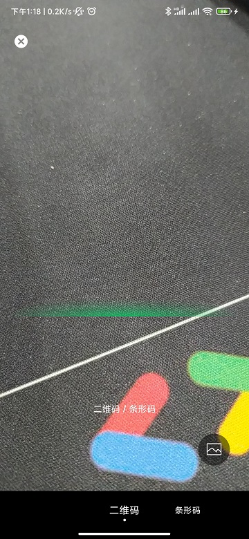
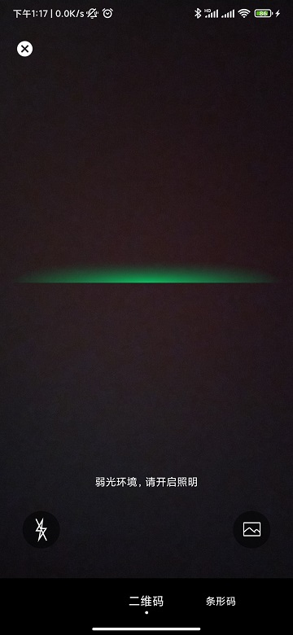
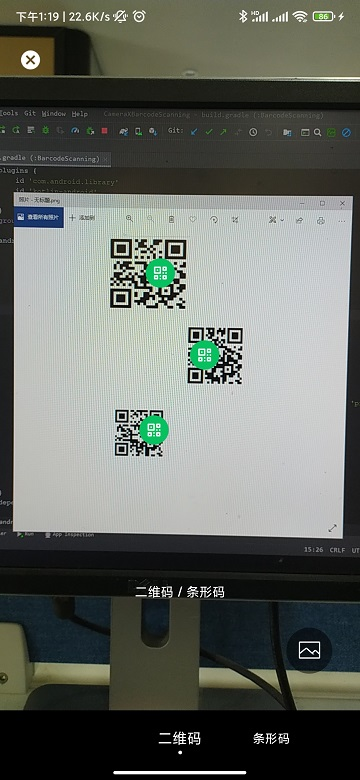
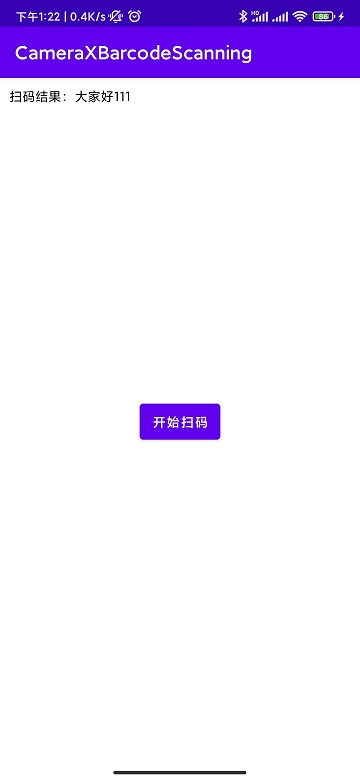

# BarcodeScanning：

高仿微信扫一扫，Android端极速二维码/条形码识别。
使用CameraX + MLKit机器学习套件实现。

 - [x]  支持一屏多码识别
 - [x]  支持双击及手势缩放
 - [x]  支持弱光环境监测提示开启闪光灯
 - [x]  支持相册扫码
 - [x]  CameraX自带生命周期管理
 - [x]  Android5.0及以上

#  效果




#  如何使用

# 1、在根目录 build.gradle 添加:

```
allprojects {
		repositories {
			...
			maven { url 'https://jitpack.io' }
		}
	}
```

# 2、在app项目下的build.gradle中添加：

```
dependencies {
	        implementation 'com.github.mtjsoft:CameraXBarcodeScanning:1.0.0'
	}
```

[](https://jitpack.io/#mtjsoft/CameraXBarcodeScanning)


# 3、使用前申请相关权限
```
Manifest.permission.CAMERA,
Manifest.permission.READ_EXTERNAL_STORAGE,
Manifest.permission.WRITE_EXTERNAL_STORAGE
```
# 4、扫一扫
```
ScanningManager.instance.openScanningActivity(
                this,
                Config(true, ScanType.QR_CODE, object : ScanResultListener {
                    override fun onSuccessListener(value: String?) {
                        // 扫码结果： value
                    }

                    override fun onFailureListener(error: String) {
                        // 扫码失败
                    }

                    override fun onCompleteListener(value: String?) {
                        // 扫码结束，不管是否成功都会回调
                        // 成功时，value 不是空且是扫码结果
                    }
                })
            )
```